# OSI Model in Practice: Layer-by-Layer Network Analysis Using a Raspberry Pi

*A walk through the OSI model reviewing basic concepts and traffic flow*

---

## Why This Matters

Networking concepts like IP addressing, MAC resolution, and TCP handshakes are easy to memorize but hard to truly understand without seeing them in action. This project was built to close that gap — to take abstract OSI model theory and make it visible, traceable, and real.

By building a physical network from scratch, capturing live traffic with Wireshark, and simulating the same topology in Cisco Packet Tracer, every layer of the OSI model became something I could observe, not just describe.

---

## Hardware & Software Used

### Hardware
- **Raspberry Pi 3** — used as the server throughout the project
- **TP-Link TL-SG605E Switch** — connected all devices on the local network
- **Laptop** — used to access the Raspberry Pi via SSH and run Wireshark
- **Ethernet cables** — physical connection between devices

### Software & Tools

| Tool | What it is | What I used it for |
|------|-----------|-------------------|
| Wireshark | Network traffic analyzer | Capturing and inspecting ARP, ICMP, TCP and HTTP packets |
| Nginx | Web server | Hosting a basic HTTP server on the Raspberry Pi |
| Cisco Packet Tracer | Network simulator | Recreating the topology virtually and visualizing packet flow |
| netcat (nc) | Network utility | Testing raw TCP connections between devices |
| SSH | Secure remote access protocol | Accessing the Raspberry Pi terminal from the laptop |

---

## Network Topology

The physical setup consisted of three devices connected through a TP-Link switch, with the switch also connected to a home router to enable DHCP address assignment.
```
Internet
    |
 Router (DHCP)
    |
 TP-Link Switch
   /        \
Laptop      Raspberry Pi
192.168.1.136   192.168.1.148
```

| Device | Interface | IP Address |
|--------|-----------|------------|
| Laptop | Wi-Fi / Ethernet | 192.168.1.136 |
| Raspberry Pi | eth0 (cable) | 192.168.1.148 |
| Raspberry Pi | wlan0 (WiFi) | 192.168.1.50 |

> **Note:** SSH access to the Raspberry Pi was maintained through the WiFi interface (wlan0) while the Ethernet interface (eth0) was used for the wired network analysis.

---

## OSI Layer Analysis

### Layer 1 — Physical

The first step was purely physical: connecting the Raspberry Pi and the laptop to the TP-Link switch using Ethernet cables, and connecting the switch to the home router. No configuration was needed at this stage — the goal was simply to establish a physical link between devices.

**Verification:** The LEDs on the switch ports lit up immediately after connecting the cables, confirming that the physical layer was active.

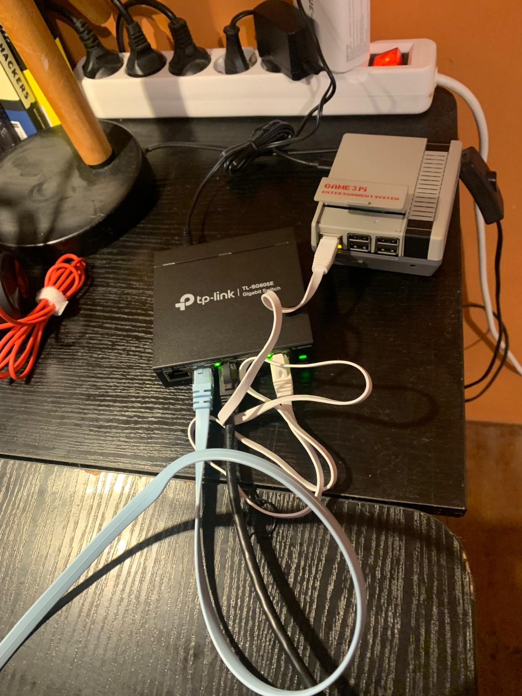

---

### Layer 2 — Data Link (Switching & ARP)

At Layer 2, the focus shifts from physical cables to how devices identify each other on the network. Every device has a unique MAC address — a hardware identifier burned into its network interface. Before any data can be sent, devices need to know the MAC address of their destination. This is where ARP (Address Resolution Protocol) comes in.

When the Raspberry Pi wanted to send a packet to the laptop, it first broadcast an ARP request to the entire network: *"Who has 192.168.1.136? Tell 192.168.1.148"*. The laptop responded with its MAC address, and from that point on, the Pi knew exactly where to send its packets.

**Verification:** Using Wireshark with the `arp` filter, we captured this exchange in real time.

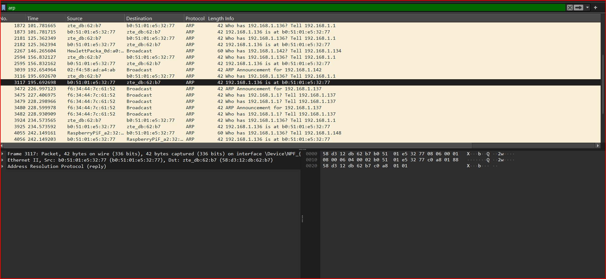

**What you can see in the capture:**
- The Pi (`RaspberryPiF_a2:32`) asking for the laptop's MAC address
- The laptop (`b0:51:01:e5:32:77`) responding with its MAC
- The switch forwarding frames between devices — invisible but essential

---

### Layer 3 — Network (IP & ICMP)

Layer 3 is where devices get logical addresses — IP addresses — and where routing decisions are made. Unlike MAC addresses which are fixed to hardware, IP addresses are assigned dynamically by a DHCP server (in this case, the home router).

The first step was confirming that the Raspberry Pi received an IP address on its Ethernet interface (`eth0`). Running `ip addr` on the Pi showed that the router had assigned it `192.168.1.148`.

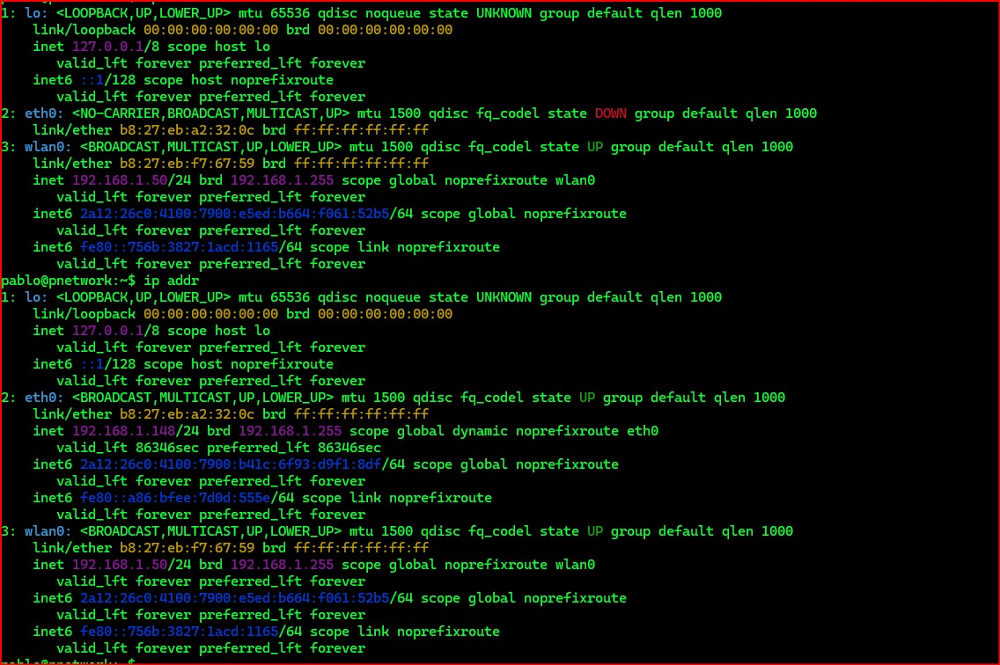

Once both devices had IP addresses, we tested connectivity using **ICMP (Internet Control Message Protocol)** — the protocol behind the `ping` command. The Raspberry Pi sent ping requests to the laptop, and Wireshark captured the packets in real time.

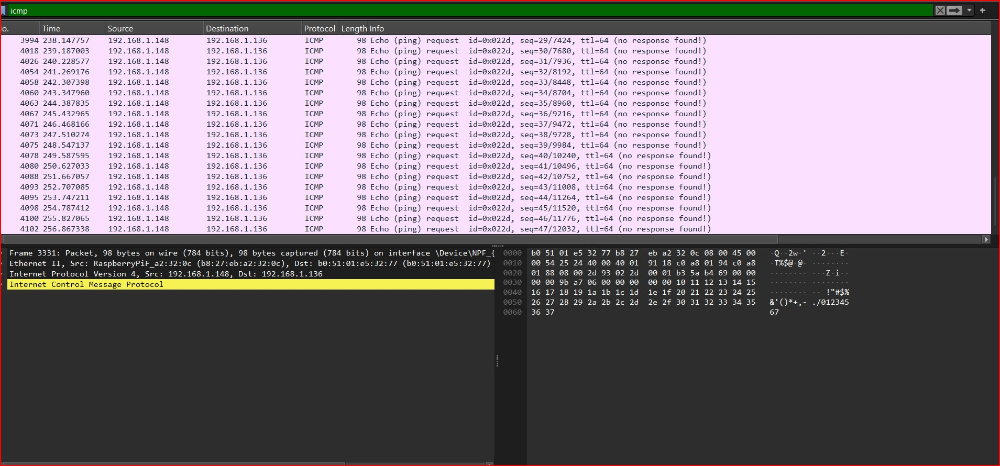

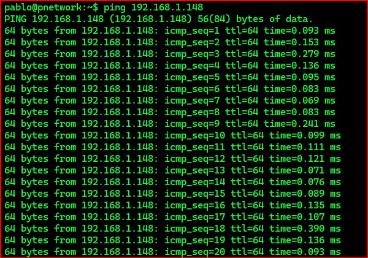

**What you can see in the captures:**
- `eth0` with IP `192.168.1.148` assigned dynamically by DHCP
- ICMP Echo requests traveling from the Pi (`192.168.1.148`) to the laptop (`192.168.1.136`)
- The Pi identified by its MAC address `RaspberryPiF_a2:32:0c` at the Ethernet frame level

---

### Layer 4 — Transport (TCP)

Layer 4 is responsible for establishing reliable connections between devices. The most common protocol at this layer is **TCP (Transmission Control Protocol)**, which guarantees that data arrives correctly and in order.

Before any data is exchanged over TCP, both devices must complete a **three-way handshake** — a three-step process to establish the connection:

1. **SYN** — the laptop says "I want to connect"
2. **SYN-ACK** — the Raspberry Pi responds "I'm ready, go ahead"
3. **ACK** — the laptop confirms "connection established"

To test this, we used **netcat** (`nc`) — a simple tool that can open raw TCP connections. We put the Raspberry Pi to listen on port 8081, then connected from the laptop using `Test-NetConnection`. Wireshark captured the entire handshake in real time.

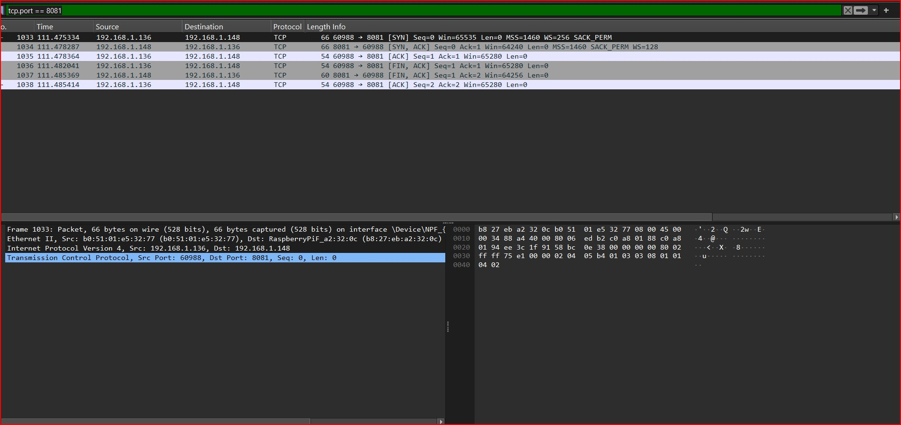

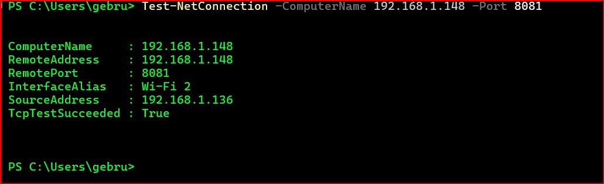

**What you can see in the captures:**
- The three-way handshake: `SYN → SYN-ACK → ACK`
- Source (`192.168.1.136`) and destination (`192.168.1.148`) clearly identified
- `TcpTestSucceeded : True` confirming the connection was established successfully

---

### Note on Layers 5 and 6

Layers 5 (Session) and 6 (Presentation) were not explicitly covered in this project. These layers deal with session management and data formatting/encryption respectively. The SSH connection used throughout the project operates at Layer 5, but was used as a tool rather than as a subject of analysis.

---

### Layer 7 — Application (HTTP)

Layer 7 is the closest layer to the end user — it's where applications communicate over the network. In this project, we installed **Nginx** on the Raspberry Pi to create a basic web server, making the Pi serve a real HTTP response to the laptop.

**What is Nginx?** Nginx (pronounced "engine-x") is a lightweight, high-performance web server. It listens for HTTP requests on a network port and responds with web content. It is widely used in production environments worldwide.

Since port 80 was already in use by **Pi-hole** (another service running on the Raspberry Pi), Nginx was configured to listen on port 8082 instead. This was a real troubleshooting scenario — not everything works out of the box.

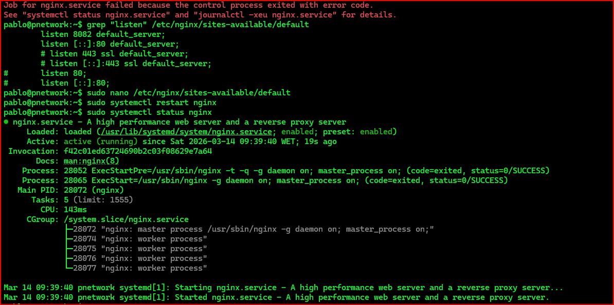

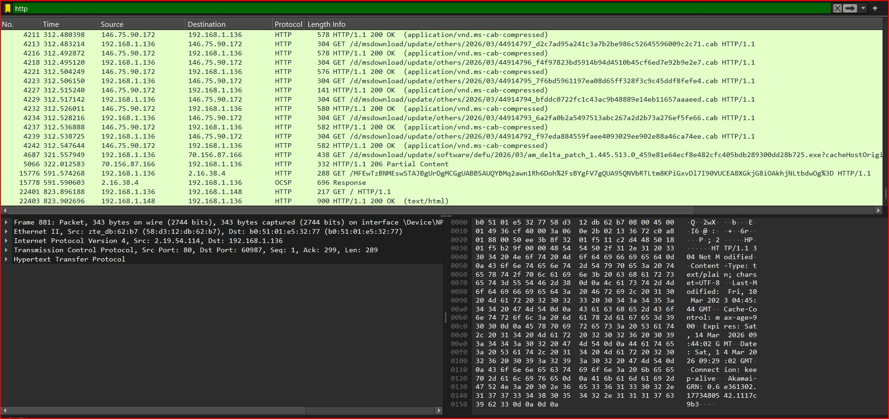

**What you can see in the captures:**
- Nginx running as `active (running)` on the Raspberry Pi
- `GET / HTTP/1.1` — the laptop requesting the page
- `HTTP/1.1 200 OK (text/html)` — the Pi responding successfully

---

## Network Simulation — Cisco Packet Tracer

To reinforce the concepts covered in the physical setup, the same network topology was recreated virtually using **Cisco Packet Tracer** — a network simulation tool developed by Cisco that allows you to build, configure, and test networks without real hardware.

The simulated topology consisted of a laptop, a switch (Cisco 2960-24TT), and a server, all connected with Ethernet cables and assigned IP addresses manually.


Using the built-in Command Prompt, a ping was executed from the laptop to the server, confirming end-to-end connectivity in the simulated environment.

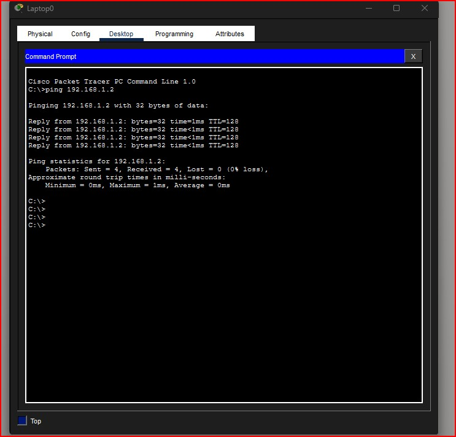

Packet Tracer's **Simulation Mode** was then activated, allowing the network packets to be visualized as they traveled between devices in real time.

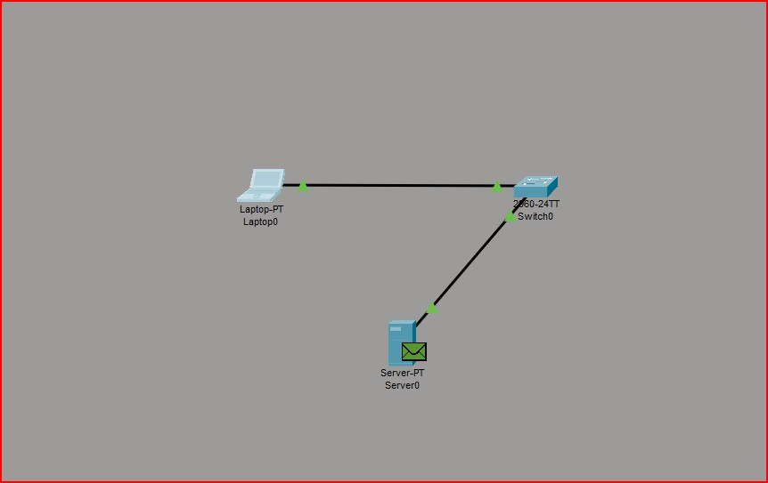

---

*This project covered all key layers of the OSI model using real hardware, live traffic capture, and network simulation — turning theory into something observable and hands-on.*
